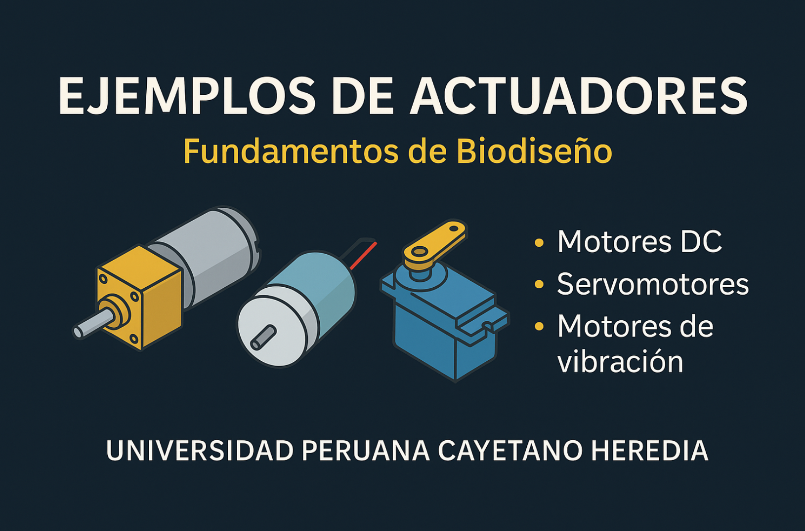

# 🧪 Ejemplos de Actuadores — Fundamentos de Biodiseño

   
  <em>Figura 1. Taller de actuadores con Arduino.</em>

Este directorio contiene ejemplos prácticos para el taller de **actuadores eléctricos** del curso **Fundamentos de Biodiseño**. Cada ejercicio permite explorar el funcionamiento y control básico de **micromotores DC**, **motores de vibración** y **servomotores**, aplicando principios de electrónica en contextos biomédicos.

Cada carpeta incluye:

- Código fuente en Arduino (.ino)
- README específico con descripción detallada
- Aplicaciones biomédicas sugeridas
- Esquemas de conexión y recomendaciones técnicas

---

## 📁 Índice de ejemplos

### 🔹 Motores DC (GA12-N20)

- [`motor_direccion_basica`](./motor_direccion_basica)  
  Controla únicamente la **dirección de giro** mediante un puente H (L298N).

- [`motor_direccion_velocidad`](./motor_direccion_velocidad)  
  Controla la **dirección y velocidad fija** mediante PWM.

- [`motor_velocidad_potenciometro`](./motor_velocidad_potenciometro)  
  Usa un **potenciómetro para variar la velocidad** del motor con PWM.

---

### 🔹 Motores de vibración

- [`vibration_motor_basico`](./vibration_motor_basico)  
  Activa y desactiva un motor vibrador usando una señal digital.

- [`vibration_motor_potenciometro`](./vibration_motor_potenciometro)  
  Controla la **intensidad de vibración** con un potenciómetro (PWM).

---

### 🔹 Servomotores (DS3235)

- [`servo_ds3235_control_basico`](./servo_ds3235_control_basico)  
  Mueve el servo a posiciones angulares fijas usando `writeMicroseconds()`.

- [`servo_ds3235_adc_pwm`](./servo_ds3235_adc_pwm)  
  Controla la posición del servo **proporcionalmente con un potenciómetro**.  
  Incluye visualización de PWM y ángulo estimado.

---

## 🎯 Objetivo didáctico

Estos ejemplos están diseñados para que el estudiante:

- Comprenda el principio de funcionamiento de distintos actuadores eléctricos.
- Aplique señales PWM y lógica digital para su control.
- Integre entradas analógicas (como potenciómetros) en sistemas de control.
- Explore aplicaciones biomédicas donde se requiera movimiento, retroalimentación o estímulo físico.

---

## 🧑‍🏫 Créditos

Desarrollado para el curso **Fundamentos de Biodiseño**  
**Docentes**: Renzo Chan Ríos / Lewis De La Cruz  
**Universidad Peruana Cayetano Heredia (UPCH)** — 2025

