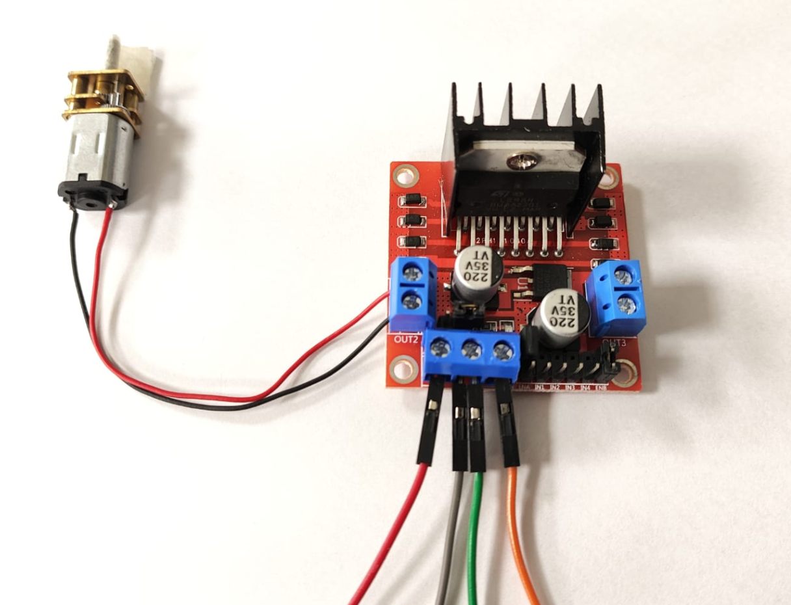

📘 Control de Dirección del Motor GA12-N20 con Arduino y L298N

   
  <em>Figura 1. Motor GA12-N20 con Arduino y L298N.</em>

Este ejemplo permite alternar el sentido de giro de un motorreductor DC GA12-N20 mediante un módulo controlador de motores L298N, sin controlar la velocidad. El sistema ejecuta un cambio de dirección cada 5 segundos, lo cual permite simular mecanismos biomédicos que requieren inversión de movimiento como válvulas alternantes o dispositivos de tracción reversibles.

🔧 ¿Qué es un motor GA12-N20?

El GA12-N20 es un motorreductor DC compacto de bajo consumo, ideal para aplicaciones donde se requiere precisión y torque moderado. Es comúnmente usado en prótesis, sistemas de posicionamiento y dispositivos portátiles.

🔬 Principio de funcionamiento

- El módulo L298N permite controlar la dirección del motor mediante dos pines digitales (IN1 e IN2).
- Si IN1 está en alto e IN2 en bajo, el motor gira en un sentido (horario).
- Si IN1 está en bajo e IN2 en alto, el motor gira en el sentido opuesto (antihorario).
- Ambos pines en bajo detienen el motor.

🪛 Esquema de conexión

| Motor GA12-N20 | L298N         | Arduino UNO |
|----------------|---------------|-------------|
| Terminal A     | OUT1          |             |
| Terminal B     | OUT2          |             |
| IN1            | IN1           | D4          |
| IN2            | IN2           | D5          |
| ENA            | 5V o puente   | (sin control PWM) |
| VCC (motor)    | 6V–12V        | Fuente externa |
| GND            | GND           | GND         |

📍 Notas:
- En este ejemplo **no se usa PWM**, por lo que el pin ENA del L298N debe estar habilitado (conectado a 5V o con jumper).
- Se recomienda usar una fuente externa adecuada para alimentar el motor.

💻 Código del ejemplo

Consulta el archivo: `motor_direccion_basica.ino`

Este programa:

- Gira el motor en sentido horario por 5 segundos.
- Se detiene durante 1 segundo.
- Cambia a sentido antihorario por 5 segundos.
- Se detiene nuevamente, y repite el ciclo.

📈 Aplicaciones biomédicas

- Dispositivos de tracción mecánica alternante para fisioterapia
- Mecanismos de válvula inversa en sistemas de dosificación
- Simuladores de compresión rítmica o presión alternante

📎 Requisitos

- 1 motorreductor GA12-N20 (6V)
- 1 módulo controlador L298N
- 1 fuente de alimentación externa (batería o adaptador 6–12V)
- 1 placa Arduino UNO o compatible
- Protoboard y cables Dupont
- Arduino IDE instalado (v1.8.x o 2.x)

🎥 Material Complementario

- 📄 *DC Motor Direction Control – Arduino & L298N Tutorial* (PDF o video)
- 📺 Video: *Motor Control with L298N and Arduino* (Español/Inglés)
- 📄 Artículo: *Applications of Reversible DC Motors in Biomedical Devices*

🧑‍🏫 Créditos

Este ejemplo fue desarrollado para el curso **Fundamentos de Biodiseño**  
**Docentes**: Renzo Chan Ríos / Lewis De La Cruz  
**Universidad Peruana Cayetano Heredia (UPCH)** — 2025  
**Versión**: 0.1

