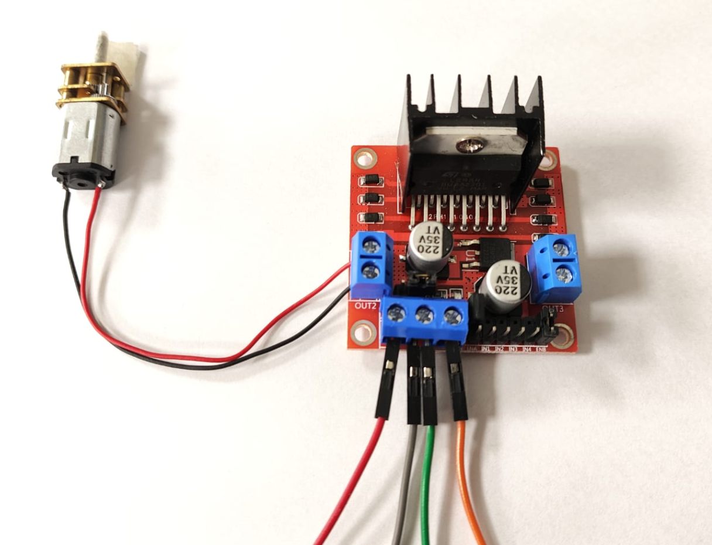

📘 Control de Velocidad del Motor GA12-N20 con Potenciómetro y Arduino

   
  <em>Figura 1. Motor GA12-N20 con Arduino y L298N.</em>

Este ejemplo permite controlar la velocidad de un motorreductor DC tipo GA12-N20 utilizando un potenciómetro conectado a una entrada analógica de Arduino. La lectura del potenciómetro se convierte en una señal PWM aplicada al módulo controlador L298N. Además, el valor analógico y el PWM generado se muestran en el monitor serial, permitiendo un análisis en tiempo real.

🔧 ¿Qué es un potenciómetro?

Un potenciómetro es un divisor de voltaje variable que puede utilizarse para introducir valores analógicos en un microcontrolador. Es ideal para simular entradas manuales como controles de velocidad, nivel o intensidad.

🔬 Principio de funcionamiento

- El usuario gira el potenciómetro para cambiar su resistencia.
- El Arduino lee el valor analógico (ADC) del potenciómetro en el rango de 0 a 1023.
- Ese valor se mapea a una señal PWM (0 a 255), que regula la velocidad del motor mediante el pin ENA del L298N.
- La dirección de giro se mantiene fija (sentido horario).

📊 Monitoreo serial

El código imprime por el monitor serial:

- El valor ADC leído del potenciómetro.
- El valor PWM generado como salida.

Esto permite observar la relación directa entre la entrada del usuario y la respuesta del actuador.

🔌 Esquema de conexión

| Componente         | Conexión                       | Arduino UNO |
|--------------------|--------------------------------|-------------|
| Potenciómetro      | VCC – OUT – GND                | A0 (OUT)    |
| GA12-N20 Motor     | OUT1 / OUT2 (L298N)            |             |
| L298N ENA          | PWM                            | D3 (PWM)    |
| L298N IN1 / IN2    | Control de dirección           | D4, D5      |
| Fuente del motor   | 6V–12V externa al L298N        |             |
| GND (común)        | L298N, Arduino, potenciómetro  | GND         |

📍 Notas:

- La dirección del motor se fija en sentido horario (`IN1 = HIGH`, `IN2 = LOW`).
- El pin ENA recibe el valor PWM calculado a partir de la lectura analógica.
- Puedes visualizar la información en el monitor serial a 9600 baudios.

💻 Código del ejemplo

Consulta el archivo: `motor_velocidad_potenciometro.ino`

Este programa:

- Lee la entrada analógica del potenciómetro.
- Mapea el valor a un rango PWM (0–255).
- Aplica la señal PWM al motor para ajustar su velocidad.
- Imprime en el monitor serial los valores ADC y PWM cada 200 ms.

📈 Aplicaciones biomédicas

- Control manual de velocidad en dispositivos de terapia física
- Interfaces hombre-máquina de bajo costo para estimulación pasiva
- Ajuste de flujo en bombas de infusión controladas manualmente
- Prototipos de simuladores para entrenamiento clínico

📎 Requisitos

- 1 motor GA12-N20 (6V)
- 1 potenciómetro lineal (10kΩ recomendado)
- 1 módulo L298N
- 1 fuente externa (6V–12V)
- 1 placa Arduino UNO o compatible
- Protoboard y cables Dupont
- Arduino IDE instalado

🎥 Material Complementario

- 📺 Video: *PWM Motor Speed Control with Potentiometer – Arduino Tutorial*
- 📄 Recurso: *Analog Input to PWM Output – Arduino Documentation*
- 📺 Aplicación clínica: *Potentiometer-Controlled Rehab Devices* (demo)

🧑‍🏫 Créditos

Este ejemplo fue desarrollado para el curso **Fundamentos de Biodiseño**  
**Docentes**: Renzo Chan Ríos / Lewis De La Cruz  
**Universidad Peruana Cayetano Heredia (UPCH)** — 2025  
**Versión**: 0.2

