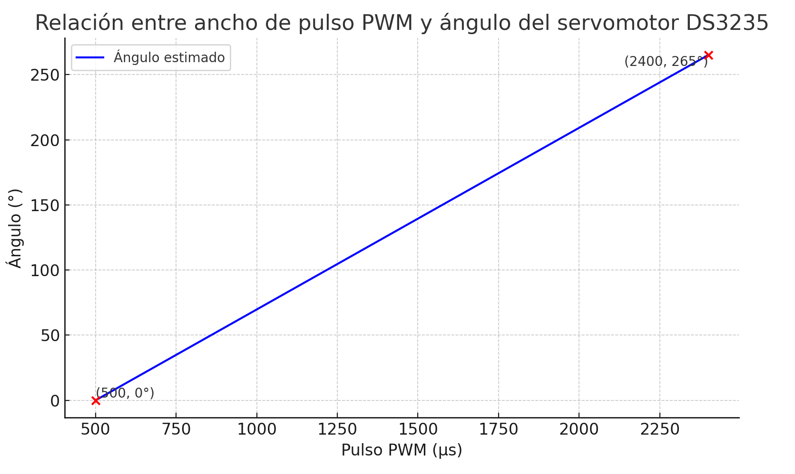
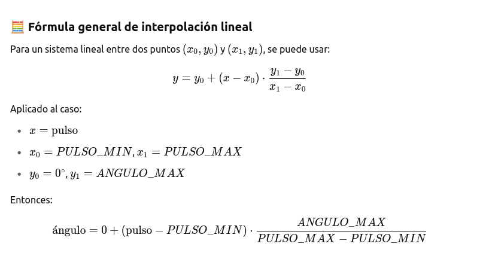

📘 Control del Servomotor DS3235 mediante Potenciómetro y PWM

   
  <em>Figura 1. Servomotor DS3235.</em>

Este ejemplo permite controlar la posición angular de un servomotor DS3235 utilizando un potenciómetro conectado a un pin analógico de un Arduino. El valor leído (ADC) se convierte directamente en una señal PWM en microsegundos, aplicada al servo mediante la función `writeMicroseconds()`. El ángulo estimado resultante se calcula solo con fines de visualización en el monitor serial.

---

🔧 ¿Qué hace este ejemplo?

- Lee el valor analógico del potenciómetro (rango 0 a 1023).
- Utiliza `map()` para transformar ese valor directamente en un pulso PWM (500 a 2400 µs).
- Envía ese pulso al servo DS3235, que se posiciona en el ángulo correspondiente.
- Estima el ángulo equivalente para ser mostrado en el monitor serial.

---

🔬 Principio de funcionamiento

Este sistema sigue la secuencia lógica:

ADC ---> PWM ---> Ángulo

El cálculo del ángulo no interviene en el control, pero permite visualizar cómo responde el servo a la entrada del usuario. Esta es una práctica común en diseño de interfaces hombre-máquina con feedback.

---

📐 Parámetros de calibración utilizados

| Parámetro        | Valor         |
|------------------|---------------|
| Rango ADC        | 0 – 1023      |
| PWM mínimo       | 500 µs        |
| PWM máximo       | 2400 µs       |
| Ángulo estimado  | 0° – 265°     |

---

🔌 Esquema de conexión

| Componente        | Arduino UNO     |
|-------------------|-----------------|
| Potenciómetro OUT | A0              |
| DS3235 Señal      | D3              |
| DS3235 V+         | Fuente externa 6V–7.4V |
| DS3235 GND        | GND común       |

📍 Recomendaciones:

- Usar una fuente externa para el servo (mínimo 2A).
- Asegurar GND común entre Arduino y fuente externa.
- Ajustar los valores de pulso mínimo/máximo si se calibra el servo manualmente.

---

💻 Código del ejemplo

Consulta el archivo: `servo_ds3235_adc_pwm.ino`

Este programa:

- Convierte la lectura del potenciómetro directamente a PWM.
- Controla el servo con `writeMicroseconds()`.
- Calcula el ángulo estimado para mostrarlo en el monitor serial.

---

📈 Aplicaciones biomédicas

- Control proporcional de articulaciones robóticas en ortesis
- Simuladores de movimiento articular para entrenamiento clínico
- Dispositivos de terapia motora con entrada manual
- Interfaces hápticas con respuesta ajustable

---

📊 Fundamento matemático

La relación entre el ancho del pulso (en microsegundos) y el ángulo del servomotor es **lineal**, y puede representarse como una **ecuación de la recta entre dos puntos** conocidos o fórmula general de interpolación:

| Pulso (µs) | Ángulo (°) |
|------------|-------------|
| 500        | 0°          |
| 2400       | 265°        |

   
  <em>Figura 2. Relación entre ancho de pulso PWM y ángulo del servomotor DS3235.</em>

   
  <em>Figura 3. Ecuación general de interpolación o de la recta entre 02 puntos.</em>

Esto permite visualizar el ángulo sin tener que controlarlo directamente, y es útil para validar que el servo responde correctamente a diferentes señales.

---

📎 Requisitos

- Servomotor DS3235
- Potenciómetro (10kΩ)
- Fuente externa de 6V–7.4V (mín. 2A)
- Arduino UNO o similar
- Arduino IDE instalado

---

🎥 Material complementario

- 📺 *Control de servo por potenciómetro con PWM – Arduino*
- 📄 *Hoja técnica DS3235 + guía de calibración*
- 📘 *Modelado de actuadores angulares en rehabilitación – IEEE Access*

---

🧑‍🏫 Créditos

Este ejemplo fue desarrollado para el curso **Fundamentos de Biodiseño**  
**Docentes**: Renzo Chan Ríos / Lewis De La Cruz  
**Universidad Peruana Cayetano Heredia (UPCH)** — 2025  
**Versión**: 0.3

