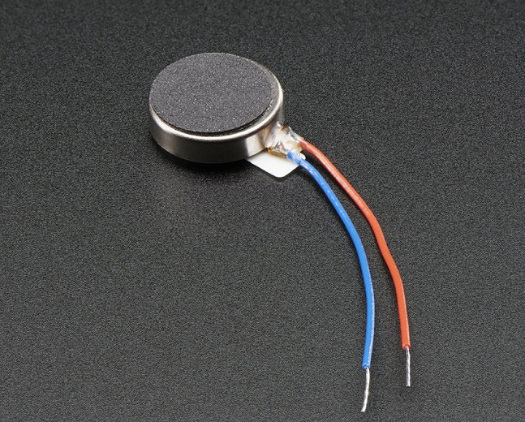

📘 Activación Básica de un Micromotor de Vibración con Arduino

   
  <em>Figura 1. micro motor vibrador.</em>

Este ejemplo muestra cómo activar un micromotor de vibración (tipo coin cell) utilizando un Arduino UNO y un transistor NPN como interruptor. Se trata de una implementación básica de retroalimentación háptica, común en dispositivos biomédicos como alarmas silenciosas o señales táctiles en interfaces hombre-máquina.

🔧 ¿Qué es un micromotor de vibración?

Un micromotor de vibración es un actuador que genera movimiento vibratorio al girar una masa desbalanceada. Su activación es simple y puede controlarse con una señal digital desde un microcontrolador, usualmente mediante un transistor de conmutación.

🔬 Principio de funcionamiento

- El Arduino envía una señal digital que activa el transistor.
- Al cerrarse el circuito, el motor recibe energía desde la fuente y comienza a vibrar.
- La vibración se puede usar como estímulo físico para el usuario (feedback táctil).

🔌 Esquema de conexión

| Micromotor de vibración | Transistor NPN (ej. 2N2222) | Arduino UNO |
|--------------------------|-----------------------------|--------------|
| Terminal positivo (+)    | 5V                          |              |
| Terminal negativo (–)    | Colector                    |              |
| Emisor                   | GND                         |              |
| Base del transistor      | Resistencia de 1kΩ          | Pin digital 3 |

📍 Recomendaciones:
- Usa un diodo flyback (ej. 1N4007) entre los terminales del motor para proteger el transistor de picos de voltaje inducido.
- El pin digital del Arduino se configura como salida y se pone en ALTO para activar la vibración.

💻 Código del ejemplo

Consulta el archivo: `vibration_motor_basico.ino`

Este programa:

- Activa el motor durante 2 segundos.
- Lo apaga durante 1 segundo.
- Repite el ciclo indefinidamente.

📈 Aplicaciones biomédicas

- Señales hápticas en sistemas de biofeedback (p. ej. postura, frecuencia cardíaca)
- Alarmas discretas para pacientes con pérdida auditiva
- Interfaces sensoriales en rehabilitación y estimulación multisensorial

📎 Requisitos

- 1 micromotor de vibración tipo coin cell (3V–5V)
- 1 transistor NPN (ej. 2N2222 o S8050)
- 1 diodo de protección (ej. 1N4007)
- 1 resistencia de 220Ω
- Protoboard y cables Dupont
- 1 placa Arduino UNO o compatible
- Arduino IDE instalado (v1.8.x o 2.x)

🎥 Material Complementario

A continuación se presentan algunos videos y recursos para ampliar conocimientos sobre actuadores hápticos y su uso en salud:

- 📄 Artículo: *Vibrotactile feedback in prosthetic devices* – IEEE Reviews
- 📺 Video: *How Haptic Feedback Works – Engineering Explained* (Inglés)
- 📺 Tutorial Arduino + Motor de Vibración (ESP)

🧑‍🏫 Créditos

Este ejemplo fue desarrollado para el curso **Fundamentos de Biodiseño**  
**Docentes**: Renzo Chan Ríos / Lewis De La Cruz  
**Universidad Peruana Cayetano Heredia (UPCH)** — 2025  
**Versión**: 0.1

