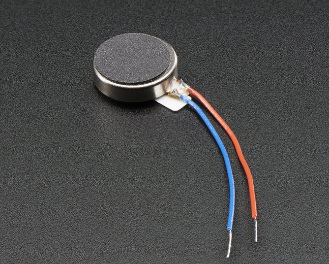

📘 Control de Intensidad de Vibración con Potenciómetro y Arduino

   
  <em>Figura 1. micro motor vibrador.</em>

Este ejemplo permite controlar la intensidad de vibración de un micromotor tipo coin cell utilizando un potenciómetro como entrada de usuario. La señal analógica se convierte en una señal PWM que regula la energía entregada al motor a través de un transistor. El sistema permite simular un control háptico proporcional, ideal para interfaces biomédicas de retroalimentación sensorial.

🔧 ¿Qué es un actuador vibratorio?

Un motor de vibración (vibratory motor) es un actuador que genera una sensación táctil mediante un movimiento rotatorio desbalanceado. Son usados frecuentemente en dispositivos médicos para proporcionar alertas discretas o estímulos sensoriales.

🔬 Principio de funcionamiento

- El potenciómetro genera una señal analógica proporcional a su posición.
- Arduino la convierte en una señal PWM (modulación por ancho de pulso).
- El PWM controla la base de un transistor NPN, que conmuta el motor vibrador.
- La intensidad de vibración varía en tiempo real según el valor del potenciómetro.

🔌 Esquema de conexión

| Componente              | Conexión                        | Arduino UNO  |
|-------------------------|----------------------------------|--------------|
| Potenciómetro           | VCC – OUT – GND                 | A0 (OUT)     |
| Micromotor de vibración | + terminal a 5V                 |              |
|                         | - terminal al colector del transistor |
| Transistor NPN          | Emisor a GND, base con 1kΩ a D3 | D3 (PWM)     |
| Diodo de protección     | En paralelo con el motor (1N4007) |              |

📍 Notas:

- Se recomienda usar un transistor NPN (ej. 2N2222 o S8050) para conmutar el motor.
- Añadir un diodo flyback para proteger el transistor de picos de corriente.
- El valor PWM (0–255) y el valor analógico del potenciómetro (0–1023) se imprimen en el monitor serial para análisis en tiempo real.

💻 Código del ejemplo

Consulta el archivo: `vibration_motor_potenciometro.ino`

Este programa:

- Lee un valor analógico desde un potenciómetro.
- Convierte ese valor en señal PWM proporcional.
- Aplica la señal al motor vibrador a través de un transistor.
- Imprime por el monitor serial el valor ADC y el PWM correspondiente.

📈 Aplicaciones biomédicas

- Sistemas de retroalimentación táctil en órtesis y prótesis
- Estimulación sensorial controlada en terapia ocupacional
- Dispositivos de entrenamiento con respuesta háptica
- Interfaz usuario-dispositivo sin estímulo visual

📎 Requisitos

- 1 micromotor de vibración tipo coin cell
- 1 potenciómetro lineal (10kΩ)
- 1 transistor NPN (ej. 2N2222)
- 1 resistencia de 1kΩ
- 1 diodo de protección (1N4007)
- Protoboard y cables Dupont
- Arduino UNO o compatible
- Arduino IDE instalado

🎥 Material Complementario

- 📺 Video: *Arduino + Vibration Motor + Potentiometer (PWM Control)*
- 📄 Artículo: *Designing Vibrotactile Feedback in Wearables* – IEEE Access
- 📘 Manual práctico de control PWM – Arduino.cc

🧑‍🏫 Créditos

Este ejemplo fue desarrollado para el curso **Fundamentos de Biodiseño**  
**Docentes**: Renzo Chan Ríos / Lewis De La Cruz  
**Universidad Peruana Cayetano Heredia (UPCH)** — 2025  
**Versión**: 0.1

